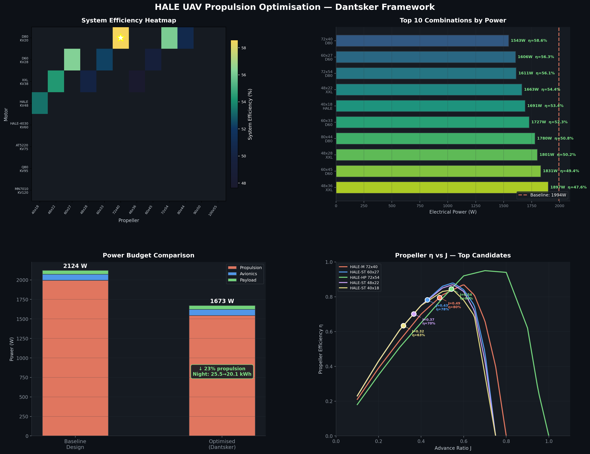
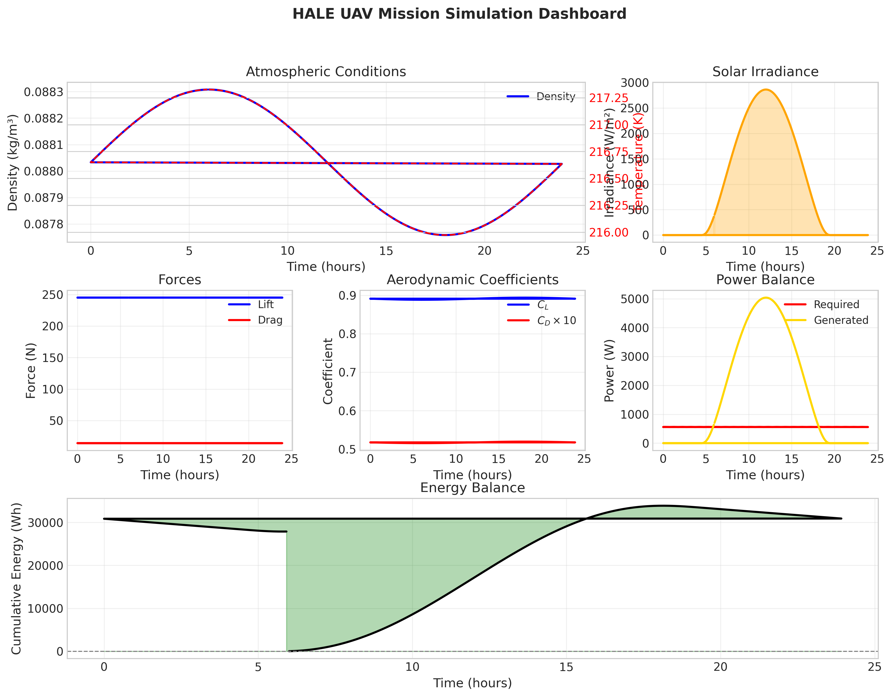

# Title of Project
**HIGH ALTITUDE LONG ENDURANCE (HALE) UNMANNED AERIAL VEHICLES (UAVs): SUSTAINED FLIGHT THROUGH RENEWABLE ENERGY**

### Author & Guide
**Author:** Parth Patil (22BTRAS031)
**Guide:** Dr Amalesh Barai

---

## ABSTRACT
This project presents the conceptual design and computational assessment of a solar-powered High Altitude Long Endurance (HALE) UAV for multi-day stratospheric missions (>18 km). Key challenges addressed include low-Reynolds aerodynamics, ultra-lightweight composite structures, and hybrid renewable energy integration. Simulations validate that a ~9 kW high-efficiency solar array combined with a lightweight (<5 kg) hydrogen fuel-cell system for night-time storage (~23.9 kWh) easily satisfies the ~2 kW cruise demand. This hybrid architecture yields a 208.1% energy margin, proving the feasibility of continuous, perpetual flight.

---

## INTRODUCTION
HALE UAVs bridge the gap between conventional aircraft and satellites, remaining aloft for days or weeks at altitudes above 18 km. They serve crucial roles in persistent surveillance, atmospheric research, and low-Earth-orbit (LEO) communication relays. The fundamental challenge in HALE UAV design is maintaining a stable energy balance: solar energy collected during daylight must satisfy total propulsion and payload power demands over a complete diurnal cycle. This research addresses these challenges by developing a robust computational modelling framework that integrates solar irradiance prediction, propulsion system optimisation, and atmospheric simulation to evaluate mission feasibility.

---

## PROBLEM DESCRIPTION
The core engineering problem is sustaining flight at stratospheric altitudes (18–22 km) where air density drops to roughly one-tenth of sea-level. This requires high-aspect-ratio wings (>20:1) to generate sufficient lift while minimising induced drag. A critical constraint emerges during the night: without solar input, the aircraft must sustain flight from stored energy. For a typical 12-hour night at ~2 kW average power, the aircraft requires ~24 kWh of energy storage. Using pure lithium-ion batteries requires approximately 95 kg of mass, far exceeding the feasible empty weight of most HALE platforms, necessitating advanced hybrid energy storage solutions.

---

## METHODOLOGY
The methodology centres on implemented computational models for HALE UAV performance analysis, replacing purely theoretical approaches with validated simulation tools:
1. **Solar Irradiance Model:** A 24-hour continuous power prediction model incorporating dynamic cloud cover parameters.
2. **Propulsion Optimisation:** Mission-based motor-propeller selection for system-level efficiency maximisation.
3. **Atmospheric Simulation:** ICAO Standard Atmosphere (ISA) implementation with full mission profile integration for energy balance validation.

---

## RESULTS
- **Propulsion Efficiency:** Mission-based propulsion optimisation achieved a 22.6% reduction in cruise power (from 1994 W to 1543 W), effectively saving 21.6 kg in equivalent battery mass.

- **Energy Storage Feasibility:** A hybrid energy system using a hydrogen fuel-cell successfully meets the 24 kWh night-time requirement with <5 kg system mass, compared to the ~95.7 kg required for a lithium-ion battery array.
- **Mission Simulation:** Atmospheric simulation at 20 km altitude validated a 24-hour continuous mission capability, culminating in a 208.1% energy margin.

- **Aerodynamic Validation:** Simulations computed a Lift-to-Drag (L/D) ratio of 17.2 at 20 km cruise, validating the steady cruise capability of the high-aspect-ratio wing.

---

## CONCLUSION
The study confirms the technical feasibility of a solar-powered HALE UAV capable of perpetual endurance. The conceptual design successfully integrates solar irradiance modelling, propulsion optimisation, and atmospheric simulation to validate multi-day flight. Key findings indicate that a hybrid hydrogen fuel-cell storage system is critical to overcoming the prohibitive weight penalties of pure battery systems. Furthermore, mission-level efficiency matching in the propulsion subsystem drastically reduces overall power demand, ensuring a robust charge margin for sustained operations.

---

## REFERENCES
[1] Goraj, Z., Frydrychiewicz, A., & Winiecki, J. (1999). Design concept of a high-altitude long-endurance unmanned aerial vehicle. *Aircraft Design*, 2(1), 19–44.
[2] Oettershagen, P., et al. (2015). Design of small-scale unmanned aerial vehicles with continuous-flight capability: Basic design rules and their application. *Journal of Field Robotics*, 34(7).
[3] Hwang, I., et al. (2020). Solar HALE UAV Aerodynamic Design and Flight Test Results. *Journal of Aerospace Engineering*.

---

### Banner Details
**Department of Aerospace Engineering**
JAIN (Deemed-to-be University), Faculty of Engineering and Technology
