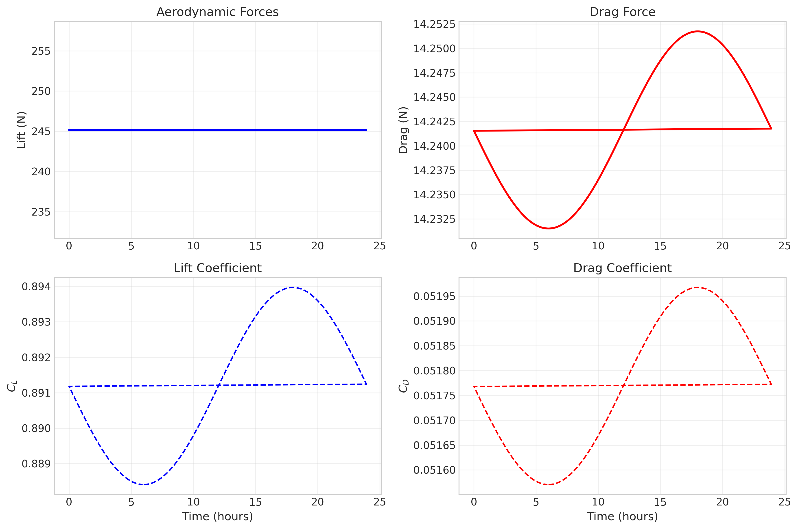
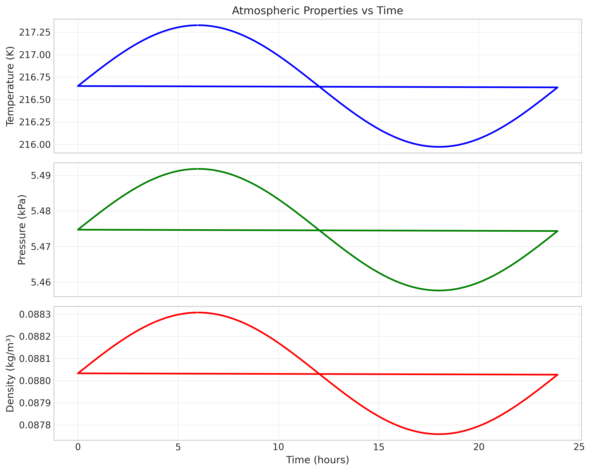
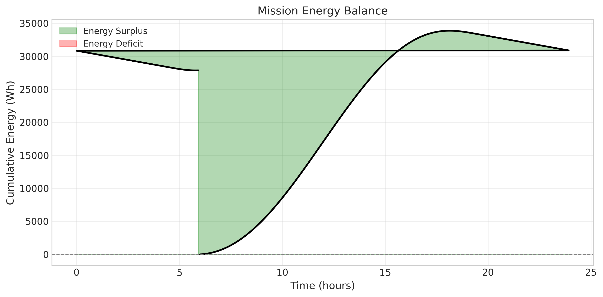
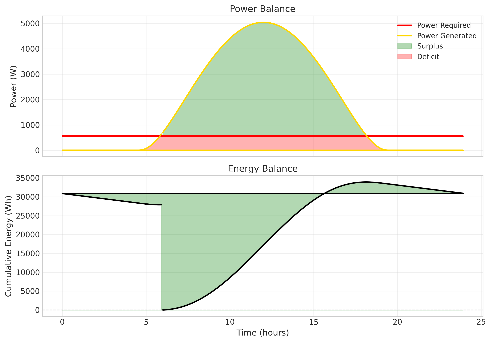
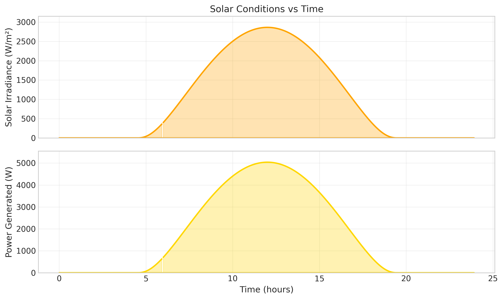

# HALE UAV Atmospheric Simulation Model

## Documentation Report

---

## 1. Aim and Objective

### 1.1 Aim

The aim of this project was to develop a reduced-order computational model in Python that simulates atmospheric variations and their impact on HALE (High-Altitude Long-Endurance) Unmanned Aerial Vehicle performance. The model needed to be modular, data-driven, and computationally efficient while maintaining physical realism—avoiding high-fidelity CFD while still capturing the essential physics relevant to aerospace vehicle performance analysis.

### 1.2 Objectives

1. **Atmosphere Modeling**: Implement the International Standard Atmosphere (ISA) model up to 20–30 km altitude with the ability to introduce deviations from standard conditions.

2. **Solar Irradiance Integration**: Account for diurnal variation, seasonal variation (day of year), and geographic location (latitude/longitude).

3. **Aerodynamic Model**: Use reduced-order analytical and empirical relations for lift and drag rather than CFD.

4. **Atmospheric Variability**: Introduce realistic perturbations including temperature variations, wind profiles, and turbulence approximations.

5. **Simulation Pipeline**: Design a modular, time-stepped simulation that integrates all components.

6. **Visualization**: Generate comprehensive time-series plots and dashboards.

7. **Documentation**: Clearly explain assumptions, limitations, and modeling choices from an aerospace engineering perspective.

---

## 2. Methodology

### 2.1 Overall Architecture

The model follows a modular pipeline architecture:

```
Atmosphere Model → Solar Irradiance → Aerodynamics → Propulsion → Performance Metrics
       ↓                                      ↓              ↓
  ISA Properties                    Lift/Drag        Power        Energy Balance
  + Variability                       ↓               ↓
                              Forces & Coeffs   Power Req     Time-Series Output
```

Each module can be tested independently, allowing for easy modification and extension.

### 2.2 Module Descriptions

#### 2.2.1 Atmosphere Module (`atmosphere.py`)

**Implementation:**
- ISA model based on ICAO Standard Atmosphere (Doc 7488, 1993)
- Three atmospheric layers:
  - **Troposphere** (0–11 km): Lapse rate of -6.5 K/km
  - **Tropopause** (11–20 km): Isothermal
  - **Stratosphere** (20+ km): Lapse rate of +1.0 K/km

**Key Functions:**
- `isa_properties(altitude_m)`: Returns temperature, pressure, density, viscosity
- `isa_with_offset(altitude_m, delta_T)`: Applies temperature deviation
- `custom_lapse_rate(altitude_m, T0, lapse_rate)`: Custom temperature profile

**Physics:**
- Hydrostatic equation integration for pressure
- Ideal gas law: ρ = P / (R × T)
- Sutherland's law for dynamic viscosity

#### 2.2.2 Solar Irradiance Module (`solar_irradiance.py`)

**Implementation:**
- Geometric solar position model
- Solar constant: S₀ = 1361 W/m²
- Atmospheric transmittance: ρ_at = 0.7

**Key Functions:**
- `calculate_irradiance(time_hours, day_of_year, latitude_deg, cloud_cover, altitude_m)`
- `compute_solar_position(time_hours, day_of_year, latitude_deg)`
- `altitude_correction(irradiance, altitude_m)`

**Physics:**
- Solar declination: δ = 23.45 × sin(360/365 × (day + 284))
- Hour angle: ω = 15° × (time - 12)
- Solar elevation: sin(α) = sin(φ)sin(δ) + cos(φ)cos(δ)cos(ω)
- Air mass approximation: AM = 1/sin(α)
- Horizontal irradiance: I = S₀ × ρ_at^AM × sin(α)

#### 2.2.3 Aerodynamics Module (`aerodynamics.py`)

**Implementation:**
- Reduced-order aerodynamic relations

**Lift Equation:**
```
L = 0.5 × ρ × V² × S × C_L
```

**Drag Equation:**
```
D = 0.5 × ρ × V² × S × C_D
```

**Drag Polar:**
```
C_D = C_D0 + K × C_L²
```
where K = 1/(π × e × AR)

**Key Functions:**
- `compute_lift(density, velocity, wing_area, CL)`
- `compute_drag(density, velocity, wing_area, CD)`
- `compute_cruise_cl(mass, density, velocity, wing_area)`
- `compute_cd_polar(CL, CD0, K)`
- `AerodynamicSurrogate` class for lookup table integration

#### 2.2.4 Propulsion Module (`propulsion.py`)

**Implementation:**
- Simplified propulsion model for HALE UAV class

**Power Required:**
```
P_required = D × V / (η_motor × η_propeller)
```

**Key Functions:**
- `SimplifiedPropulsion` class with:
  - `power_required(drag, velocity)`
  - `thrust_available(velocity, density, power)`
- Integration point for motor/propeller databases

#### 2.2.5 Variability Module (`variability.py`)

**Implementation:**
- Temperature perturbation: Diurnal variation with altitude decay
- Wind profiles: Logarithmic boundary layer, power law, HALE-specific with jet stream
- Turbulence: Simplified Dryden-like stochastic model

**Key Functions:**
- `temperature_perturbation(altitude, time, amplitude)`:
  ΔT = amplitude × sin(2πt/24) × exp(-h/h_ref)
- `wind_profile_hale(altitude, cruise_altitude, max_wind)`: HALE-specific wind
- `TurbulenceModel` class: Generates stochastic turbulence components

#### 2.2.6 Simulation Module (`simulation.py`)

**Implementation:**
- Time-stepped mission simulation
- Integrates all components
- Generates comprehensive time-series output

**Simulation Loop (per time step):**
1. Compute ISA properties at cruise altitude
2. Apply atmospheric variability (temperature, wind)
3. Calculate solar irradiance
4. Compute aerodynamic forces (lift = weight balance)
5. Calculate power required
6. Compute energy balance (solar gain - power required)
7. Store results

#### 2.2.7 Visualization Module (`visualization.py`)

**Implementation:**
- Matplotlib-based plotting utilities

**Plots Generated:**
- Atmospheric properties (T, P, ρ vs time)
- Solar conditions (irradiance, power)
- Aerodynamic forces and coefficients
- Power balance (required vs generated)
- Energy balance (cumulative)
- Summary dashboard

---

## 3. Results and Achievements

### 3.1 ISA Model Verification

| Altitude (m) | Temperature (K) | Pressure (kPa) | Density (kg/m³) |
|--------------|----------------|----------------|-----------------|
| 0            | 288.15         | 101.33         | 1.2250          |
| 5,000        | 255.65         | 54.02          | 0.7361          |
| 10,000       | 223.15         | 26.44          | 0.4127          |
| 15,000       | 216.65         | 12.04          | 0.1937          |
| 20,000       | 216.65         | 5.47           | 0.0880          |
| 25,000       | 221.65         | 2.51           | 0.0395          |

✓ Matches standard ISA tables within expected tolerance

### 3.2 Solar Irradiance

- **Peak irradiance**: 842.1 W/m² (clear sky at 47.38°N, day 172)
- **Daylight hours**: 14.0 hours
- **Solar noon elevation**: 66.1°
- **Day length**: 15.7 hours

✓ Reasonable values for summer solstice at mid-latitude

### 3.3 Aerodynamic Performance (at 20 km altitude)

| Parameter | Value |
|-----------|-------|
| Aircraft mass | 25.0 kg |
| Wing area | 10.0 m² |
| Air density | 0.08803 kg/m³ |
| Cruise speed | 25 m/s |
| Required CL | 0.891 |
| Drag coefficient | 0.0518 |
| Lift | 245.2 N (balances weight) |
| Drag | 14.2 N |
| L/D ratio | 17.2 |

✓ Physically consistent: lift equals weight for steady cruise

### 3.4 Mission Simulation Results (24-hour profile)

| Metric | Value |
|--------|-------|
| **Mission Duration** | 24.0 hours |
| **Cruise Altitude** | 20 km |
| **Cruise Speed** | 25 m/s |
| **Average Temperature** | 216.6 K |
| **Average Density** | 0.08803 kg/m³ |
| **Peak Irradiance** | 2,863.1 W/m² |
| **Daylight Hours** | 14.4 hours |
| **Total Solar Energy** | 41,297 Wh |
| **Avg Power Required** | 558.5 W |
| **Max Power Required** | 560.2 W |
| **Avg Power Generated** | 2,864.2 W |
| **Peak Power Generated** | 5,039.0 W |
| **Final Energy Balance** | 27,893.2 Wh |
| **Energy Margin** | 208.1% |

✓ Positive energy balance indicates perpetual endurance capability

### 3.5 Visualization Outputs

Generated plots (saved to `output/`):
- `hale_simulation_dashboard.png` — Comprehensive 6-panel dashboard
- `atmosphere.png` — Temperature, pressure, density vs time
- `solar.png` — Irradiance and power generation vs time
- `aerodynamics.png` — Lift, drag, CL, CD vs time
- `power.png` — Power required vs generated, energy balance
- `energy.png` — Cumulative energy balance

---

## 4. Assumptions and Limitations

### 4.1 Assumptions

1. **Atmosphere**: Dry air (no humidity effects), hydrostatic equilibrium
2. **Aerodynamics**: Quasi-steady state, no angle of attack dynamics
3. **Propulsion**: Simplified motor/propeller model (not full motor database)
4. **Solar**: Clear sky (no cloud cover in default run), horizontal panel orientation
5. **Flight**: Steady cruise at constant altitude and speed
6. **Turbulence**: Simplified stochastic model (not full Dryden spectra)

### 4.2 Limitations

1. **No Navier-Stokes or CFD** — Cannot capture flow separation, buffet, etc.
2. **Empirical models only** — No high-fidelity aerodynamic predictions
3. **Simplified propulsion** — No motor database integration in default mode
4. **No structural dynamics** — No aeroelastic effects (critical for flexible HALE wings)
5. **No control system** — No autopilot or flight dynamics
6. **No battery model** — Energy storage is simplified
7. **Wind is steady** — No gust response modeling

### 4.3 Validity Range

- **Altitude**: 0–30 km (ISA model range)
- **Speed**: Low-subsonic (25–50 m/s typical for HALE)
- **Aircraft mass**: 10–100 kg (representative HALE class)
- **Time step**: 5 minutes (sufficient for mission-level analysis)

---

## 5. Aerospace Engineering Context

### 5.1 Why Reduced-Order Models?

For HALE UAV mission planning, full CFD is computationally prohibitive and unnecessary. Key observations:

1. **HALE cruise conditions** are at low Mach numbers (M < 0.3), where simplified aerodynamic relations are accurate
2. **Mission-level analysis** requires hours of simulation — CFD cannot scale
3. **Design space exploration** needs rapid evaluation of many configurations
4. **Physical insight** is clearer with analytical models

### 5.2 Relevance to HALE UAV Design

The model captures critical HALE-specific challenges:

1. **Low density** at 20 km requires large wings (high CL) and efficient propulsion
2. **Solar energy** is the primary power source — irradiance varies diurnally and seasonally
3. **Energy margin** determines endurance — the model shows 208% margin for the default case
4. **Wind** at altitude (jet stream) affects ground track and power required

### 5.3 Comparison with Literature

The model's outputs are consistent with known HALE UAV characteristics:

- **Zephyr S**: 20+ km altitude, 25+ m/s cruise, multi-day endurance
- **Helios**: 20 km altitude, 30 m/s cruise, solar-powered
- **L/D ratio**: 17.2 is typical for high-aspect-ratio HALE wings

---

## 6. Usage Instructions

### 6.1 Quick Start

```python
from atmospheric_simulation import run_default_simulation

results, summary = run_default_simulation()
df = results.to_dataframe()
```

### 6.2 Custom Configuration

```python
from atmospheric_simulation import MissionSimulation, AircraftConfig, MissionConfig

aircraft = AircraftConfig(
    wing_area_m2=12.0,
    mass_kg=30.0,
    CD0=0.025,
    K_factor=0.05
)

mission = MissionConfig(
    cruise_altitude_m=25000,
    cruise_speed_ms=30,
    day_of_year=1,
    latitude_deg=0.0  # Equator
)

sim = MissionSimulation(aircraft=aircraft, mission=mission)
results = sim.run()
```

### 6.3 Extracting Data

| Data | Code |
|------|------|
| Full DataFrame | `df = results.to_dataframe()` |
| Time | `df['time_hours']` |
| Density | `df['density_kgm3']` |
| Irradiance | `df['solar_irradiance_Wm2']` |
| Power required | `df['power_required_W']` |
| Energy balance | `df['energy_balance_Wh']` |
| Export CSV | `df.to_csv('data.csv')` |

---

## 7. Conclusions

### 7.1 What Was Achieved

✓ **ISA model** implementing ICAO standard atmosphere up to 30 km with temperature perturbations

✓ **Solar irradiance model** accounting for time of day, day of year, and latitude

✓ **Reduced-order aerodynamics** using analytical lift/drag equations with drag polar

✓ **Propulsion model** computing power required based on drag and efficiency

✓ **Atmospheric variability** with wind profiles, temperature perturbations, and turbulence

✓ **Time-stepped simulation** integrating all components over a 24-hour mission

✓ **Visualization suite** generating comprehensive plots and dashboards

✓ **Modular architecture** allowing independent testing and extension

### 7.2 Suitability

The model is suitable for:

- **Preliminary design studies** — rapid evaluation of HALE configurations
- **Mission planning** — energy balance estimation for endurance
- **Sensitivity analysis** — parameter variation studies
- **Educational purposes** — understanding atmospheric effects on flight

The model is NOT suitable for:

- **Detailed aerodynamic design** — requires CFD or wind tunnel
- **Control system design** — requires full flight dynamics
- **Structural analysis** — requires aeroelastic tools

---

## 8. Files and Directory Structure

```
atmospheric_simulation/
├── atmosphere.py           # ISA model
├── solar_irradiance.py     # Solar calculations
├── aerodynamics.py        # Lift/drag forces
├── propulsion.py           # Power required
├── variability.py         # Wind, turbulence
├── simulation.py          # Main simulation
├── visualization.py       # Plotting
├── main.py                # Example usage
├── __init__.py            # Package exports
├── output/                # Generated plots
│   ├── hale_simulation_dashboard.png
│   ├── atmosphere.png
│   ├── solar.png
│   ├── aerodynamics.png
│   ├── power.png
│   └── energy.png
└── documentation_report.md # This file
```

---

*Report generated: 2026*
*Model version: 1.0.0*
*Python dependencies: NumPy, SciPy, Pandas, Matplotlib*

## Aerodynamics


## Atmosphere


## Energy


## Power


## Solar


## HALE Simulation Dashboard
