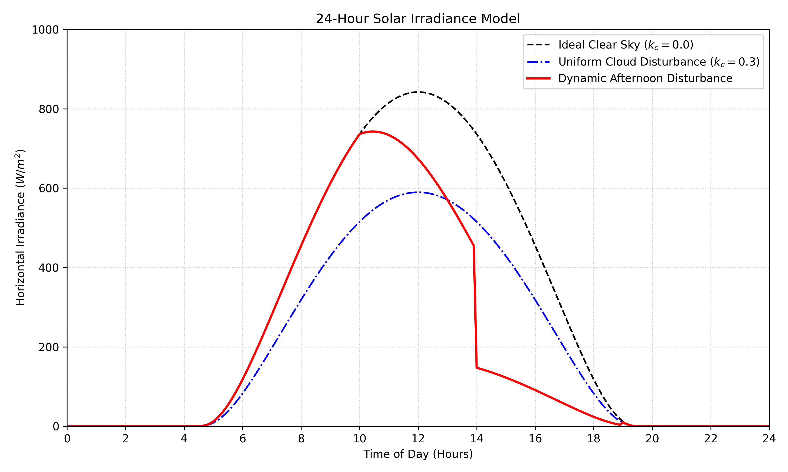

# Solar Irradiance Simulation Report

## Aim
To establish a robust mathematical model of solar irradiance over a 24-hour cycle for a solar-powered HALE (High Altitude Long Endurance) UAV, factoring in varying meteorological conditions.

## Objective
1. Calculate the theoretical direct solar irradiance on a horizontal surface across a full 24-hour period.
2. Incorporate the Air Mass (AM1.5) atmospheric transmittance approximation to simulate standard sun attenuation.
3. Apply a dynamic "Cloud Cover Disturbance Parameter" ($k_c$) to model different environmental risk scenarios, ranging from ideal clear skies to varying cloud coverage, serving as the power input ($P_{solar}$) for the AtlantikSolar charge-margin methodology loop.

## Simulation Conditions
The script `solar_model.py` was executed with the following fixed parameters:
*   **Solar Constant ($S_0$)**: $1361 \text{ W/m}^2$
*   **Latitude**: $47.38^\circ$ (Zurich coordinates, reflecting the original AtlantikSolar test environment).
*   **Day of Year**: $172$ (Summer Solstice, maximizing solar exposure).
*   **Atmospheric Transmittance ($\rho_{at}$)**: $0.7$ (Standard clear-day proxy).
*   **Disturbance Parameter ($k_c$)**: Ranging from $0.0$ (no clouds) to $1.0$ (complete blocking/nighttime equivalent).

Three distinct test scenarios were evaluated:
1.  **Ideal Clear Sky**: $k_c = 0.0$ throughout the cycle.
2.  **Uniform Disturbance**: $k_c = 0.3$ applied constantly, simulating a hazy or lightly overcast day.
3.  **Dynamic Afternoon Disturbance**: Clear skies until 10:00 ($k_c = 0.0$), escalating linearly to $k_c=0.8$ between 14:00 and 19:00 (simulating heavy afternoon storms), followed by partial clearing ($k_c=0.2$).

## What Was Achieved
The simulation successfully modeled the sun's trajectory and mapped it into a continuous horizontal irradiance waveform ($W/m^2$). The resulting plot visually verifies that the differential mathematical structure captures realistic daytime bounding and power clipping caused by dynamic weather.

This output establishes the input solar power state ($P_{solar}$) necessary for executing the differential energy equations $\left( \frac{dE_{bat}}{dt} = P_{solar} - P_{out} \right)$. With this complete, the algorithm is now prepared for the next component: mapping Power Output/Avionics consumption ($P_{out}$).

## Simulation Results

